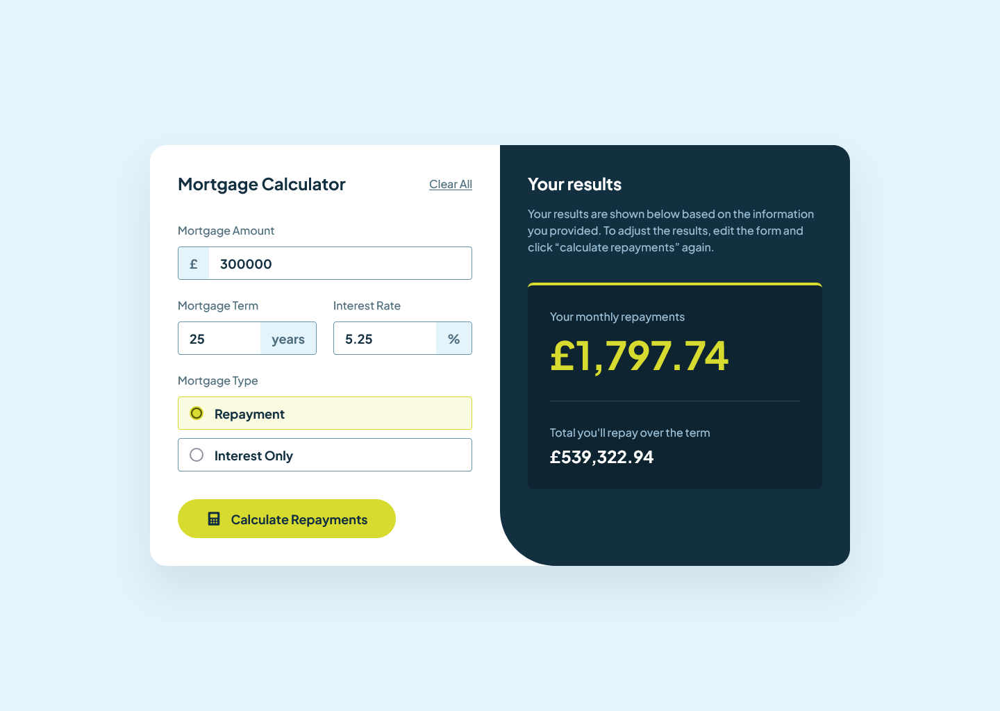

# Frontend Mentor - Mortgage repayment calculator solution

This is a solution to the [Mortgage repayment calculator challenge on Frontend Mentor](https://www.frontendmentor.io/challenges/mortgage-repayment-calculator-Galx1LXK73). Frontend Mentor challenges help you improve your coding skills by building realistic projects.

### Screenshot

### Links

- Solution URL: [Solution URL here](https://github.com/NDK1195/mortgage-repayment-calculator)
- Live Site URL: [Live site URL here](https://ndk1195.github.io/mortgage-repayment-calculator/)

### Built with

- HTML5
- Tailwind CSS
- Javascript
